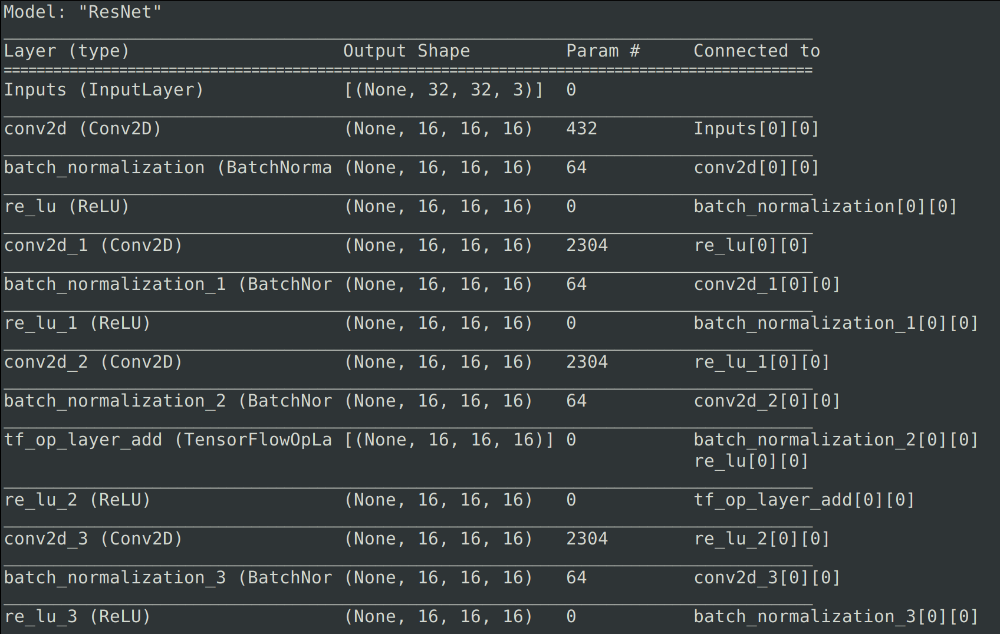
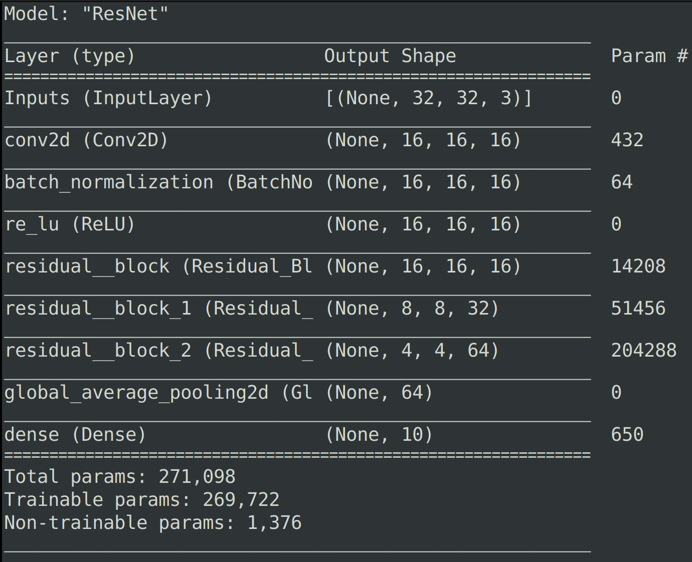
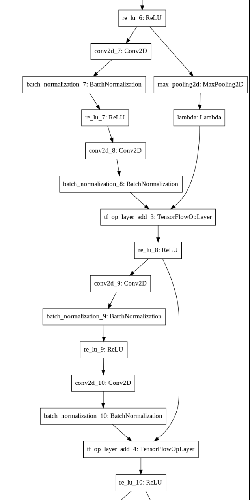
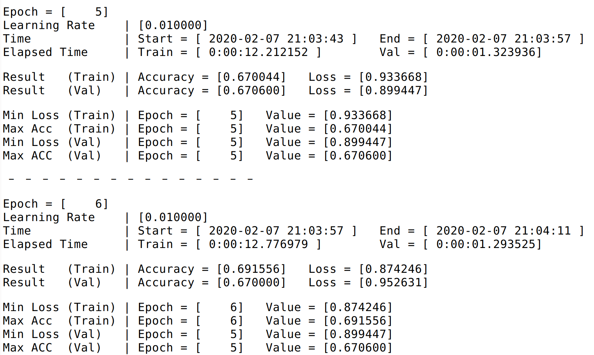
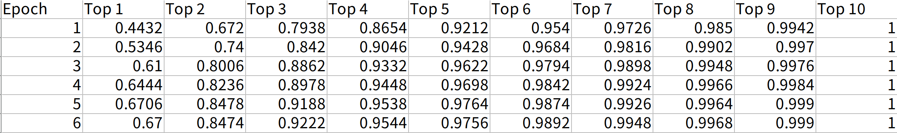

# ResNet 실행 방법

`python ResNet.py [Arguments] ...`

**ex)** 

`python ResNet.py -n 100`

---

 - Bottleneck layer는 적용하지 않았습니다.
 - Model_V2.py는 Model.py의 중간 layer 부분을 추상화하여 plot_model, summary 함수에서 간단하게 표시되도록 제작했습니다. 두 파일에 있는 ResNet model은 동일합니다.

## **tf.keras.Model.summary()**

### Model

### Model_V2

## **tf.keras.utils.plot_model()**              

### Model

### Model_V2

---

**생성되는 파일 예시**

## **training_result_file**

---

## **top_k_accuracy**

---

## **training_result_summary**

---

| No | ResNet-{} | # parameters in my model | # parameters in Paper |
| --- | --- | --- | --- |
| 1 | 20 | 269,722 | 0.27M |
| 2 | 32 | 464,154 | 0.46M |
| 3 | 44 | 658,586 | 0.66M |
| 4 | 56 | 853,018 | 0.85M |
| 5 | 110 | 1,727,962 | 1.7M |
| 6 | 1202 | 19,421,274 | 19.4M |
