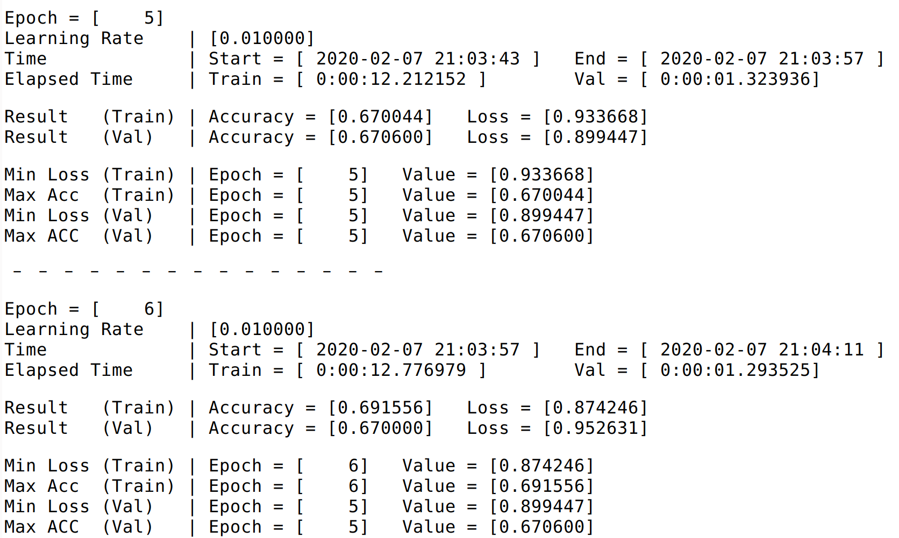
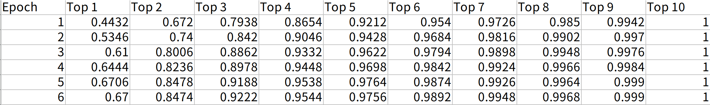

# ResNet 실행 방법

`python ResNet.py [Arguments] ...`

**ex)** 

`python ResNet.py -n 100`

---

| No | ResNet-{} | # parameters in my model | # parameters in Paper |
| --- | --- | --- | --- |
| 1 | 164 | 1,703,258 | 1.7M |
| 2 | 1001 | 10,327,706 | 10.2M |

---

### Result

참고) Label smoothing 적용 (-l "True")

##### learning rate 변화

| Epoch | Learning Rate |
| --- | --- |
| 1 ~ 200 | 0.01 |
| 201 ~ 300 | 0.005 |
| 301 ~ 400 | 0.001 |

| Model | Min Training Loss | Min Val Loss | Max Val Acc | Test Acc |
| --- | --- | --- | --- | --- |
| ResNet-164 | 0.501 | 0.716 | 0.932 | 0.927 |

---

**생성되는 파일 예시**

## **training_result_file**

---

## **top_k_accuracy**

---

## **training_result_summary**

