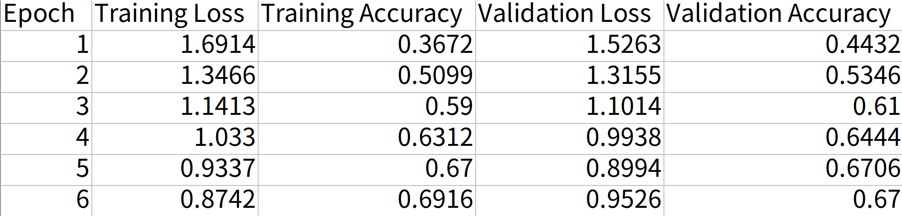

# ResNet 실행 방법

`python ResNet.py [Arguments] ...`

**ex)** 

`python ResNet.py -n 100`

---

| No | WRN-{}-{} | # parameters in my model | # parameters in Paper |
| --- | --- | --- | --- |
| 1 | 28-10 | 36,479,194 | 36.5M |
| 2 | 22-8 | 17,158,106 | 17.2M |
| 3 | 40-2 | 2,243,546 | 2.2M |
| 4 | 16-10 | 17,116,634 | 17.1M |

---

### Result

참고) Label smoothing 적용 (-l "True")

##### learning rate 변화

| Epoch | Learning Rate |
| --- | --- |
| 1 ~ 59 | 0.1 |
| 60 ~ 119 | 0.02 |
| 120 ~ 159 | 0.004 |
| 160 ~ 200 | 0.0008 |

| Model | Min Training Loss | Min Val Loss | Max Val Acc | Test Acc |
| --- | --- | --- | --- | --- |
| WRN-28-10 | 0.501 | 0.667 | 0.943 | 0.938 |

---

**생성되는 파일 예시**

## **training_result_file**

---

## **top_k_accuracy**

---

## **training_result_summary**

