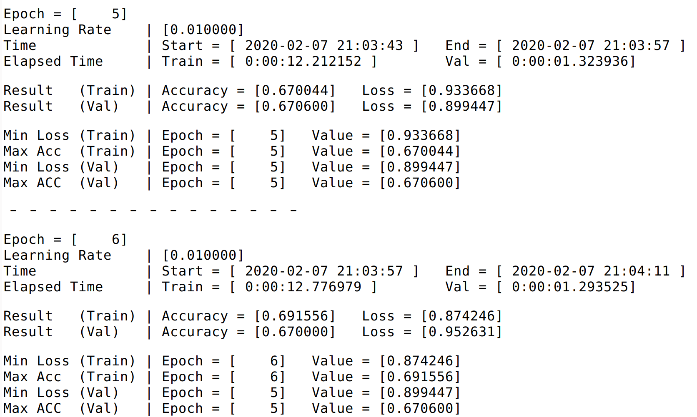

# ResNet 실행 방법

`python ResNet.py [Arguments] ...`

**ex)** 

`python ResNet.py -n 100`

---

| No | WRN-{}-{} | # parameters in my model | # parameters in Paper |
| --- | --- | --- | --- |
| 1 | 28-10 | 36,479,194 | 36.5M |
| 2 | 22-8 | 17,158,106 | 17.2M |
| 3 | 40-2 | 2,243,546 | 2.2M |
| 4 | 16-10 | 17,116,634 | 17.1M |

---

**생성되는 파일 예시**

## **training_result_file**

---

## **top_k_accuracy**

---

## **training_result_summary**

